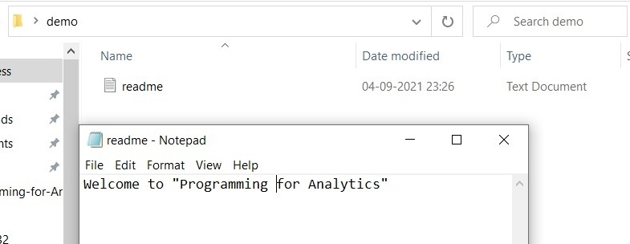
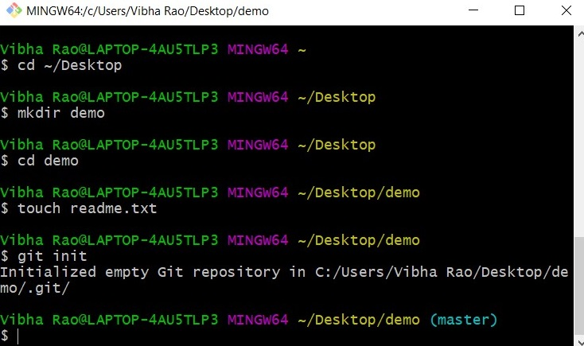
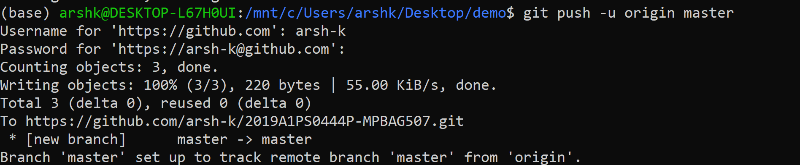
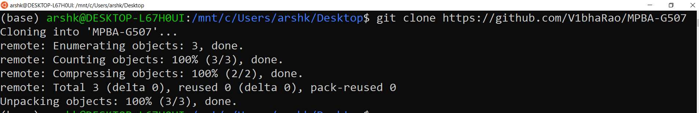

```{r setup, include=FALSE}
knitr::opts_chunk$set(echo = TRUE)
```
## What is a Version Control System?

Version control, or source control refers to the practice of tracking and managing changes in computer files. Version Control Systems (VCS) are software tools that help teams collaborate on projects and manage changes as the project evolves. Every modification made to the files is tracked in a database, and these changes can be reversed by comparing the files with earlier versions.

## What is GIT?

Git is the most widely used VCS. It was created in 2005 by Linus Torvalds. Git is used for both commercial as well as open source development due to the wide range of features it provides. 

## Concepts of GIT

- Keeps track of code history
- Takes snapshots of your files
- You can decide when to take a snapshot by making a "commit"
- You can visit any snapshot at any time.
- You can stage files before committing.


## Getting Started with Git

Installation:  Git can be downloaded from the following URL with all the default settings: [https://git-scm.com/downloads](https://git-scm.com/downloads). This comes with a command line tool called Gitbash.  

Launch Gitbash and follow these steps:  

1. Create a folder on the Desktop and move into that directory.  
`$ cd ~/Desktop`  
`$ mkdir demo`  
`$ cd demo `
 
2. Use $ touch <filename> to create new files inside the directory.
`$ touch readme.txt`
3. You can open the file created, make modifications and save it.  
  

4. To initialize this folder as a git repository and start using git commands, run the following:  
`$ git init`  
 

5. When Git is used for the first time on a computer, add your name and email address to git using the commands:
 	`$ git config --global user.name ‘your_name’`  
   `$ git config --global user.email ‘your@email_id.com’`
6. ls (list) command can be used to show the directory’s content. On adding the –a flag, we can see that Git has created a hidden directory within demo folder called .git:  
`$ ls`  
`$ ls –a`
7. To add files created to the git repository, run
`$ git add <filename>`
`$ git add` .			(to add all files at once)
8. To check if everything is set up correctly and to display the state of the staging area, run
`$ git status`  
 

9. Next, run git commit. Git takes everything that was saved by using git add and stores a copy permanently inside the special .git directory. This permanent copy is called a commit.
We use the -m flag (for “message”) to record a short, descriptive, and specific comment that will help us remember later on what we did and why.
`$ git commit –m “Add a comment”`

**NOTE**: It is standard practice to add a comment with each commit you make on the GitHub Repository.

Now, that we have worked with Git so far, let us get our hands dirty working on setting up our GitHub account.

### Staging Area 

The staging area is like a rough draft space, it's where you can `git add` the version of a file or multiple files that you want to save in your next commit (in other words in the next version of your project).

The journey a file takes to have an updated version of it added to your repository:

- It is edited in your working directory. The working directory is like a work     bench it is where you edit your files, add new files and delete files.
- Then the file is added to the staging area using the git add command.
- Finally it is included in the next commit when you use the git commit command.


## What is GitHub?

GitHub is a code hosting platform for version control and collaboration. It lets you and others work together on projects from anywhere. 

Before we begin, you must setup a GitHub account on [GitHub](https://github.com/).

After setting up your account, you can then proceed to click on the icon titled 'New' in order to create a new repository,

A repository is usually used to organize a single project. Repositories can contain folders and files, images, videos, spreadsheets, and data sets – anything your project needs.

There are 2 types of repositories, a public repository and a private repository. The former can be viewed by anyone and the latter can only be viewed by the contributors of the project. 

### Steps to set up your repository:

1) Give it a name titled your ID-MPBAG507, and choose whether you want to keep it private or public. Also, leave the check-boxes unmarked. Give a catchy description to the repository which can be edited later. Click on Create Repository.


2) GitHub navigates you to a page that shows some of the commands that we have already used before on Git. Which means a large chunk of our work is done! An image below gives us a hint on what to do next.


3) You can either copy and paste the lines with the icon on the top-left shown above to the Git command line or it would be best to type out each code line by line (For Practice!). 

**NOTE**: Copy pasting will create a branch called main, which may or may not cause issues while pushing changes to your GitHub repository so better to follow the code given below line by line.

`git remote add origin <url-name>`

The above line gives your git command line access to the repository on GitHub. The <url-name> is taken from the image above, and is different for each repository.

`git branch`

This line tells Git to check the current branch the person is working on. (Google Search about branches!).

`git push -u origin master`

Pushes the work done on your local desktop to the main branch of your GitHub repository.



4) GitHub will ask you for your user-name and your password while making a push to the repository. GitHub has introduced this secure (but annoying!) way of keeping user passwords as personal access tokens. 

TO generate a personal access token, follow this path: Settings -> Developer Settings -> Persona access tokens -> Generate new token.

A pop up will lead you to enter your GitHub password. After that, Check all the boxes and then proceed to give it a time duration for how long you want to keep the tokens available. Also, give it a note in case you want to remember what the token needs to be used for. 

Click on Generate token and you will be lead to the page where you first generated the token. 

**IMPORTANT**: Please do keep the generated token safe somewhere in a text file for later use, as it disappears once you refresh the page. 

Use this token to enter the password on your Git command line. 

5) After all that is done, navigate to your GitHub repository. Voila! You can see that the file that you had created earlier called readme.txt is now present on the GitHub repository. Good job on getting through your first GitHub workflow.


Once we are done setting up our demo repository, lets move into some more complex tasks that can be accomplished with GitHub.

### Cloning into Repositories

`git clone` 

The above line of code is primarily used to point to an existing repo and make a clone or copy of that repo in a new directory, at another location. 



Try cloning this repository called MPBA-G507 as shown in the image above in a directory on your desktop, and you will see that the files for the repository appear on your directory. The link for the repository is [https://github.com/V1bhaRao/MPBA-G507](https://github.com/V1bhaRao/MPBA-G507)


### Forking Repositories

A fork is a copy of a repository. Forking a repository allows you to freely experiment with changes without affecting the original project.

Alright, this time try and find any repository of your choice online and navigate to the repository page with all the codes listed.

Click on the Fork option at the top-right of the page.You will be navigated to a page in which a copy of repository has been made with your user-name.

**ASSIGNMENT** : In order to work with the repository, try to follow the steps of cloning the repository by yourself to your Desktop. 


## GIT Cheatsheet

`$ git init`  //Initialize Local Git Repository  
`$ git add <file>` //Add File(s) To Index  
`$ git status`  //Check Status of Working Tree  
`$ git commit`  //Commit Changes in Index  
`$ git push`    //Push to Remote Repository   
`$ git pull`    //Pull Latest From Remote Repository to check if any changes are present   
`$ git clone <url for git repository>`  // Clone Repository into a New Directory, Basically Downloads the files in the directory  

`$ git --version` //Prints out the current version of Git  

`$ git config --global user.name 'Arsh Kumbhat'` // Used to add your name   

`$ git rm --cached <file>` //Removes file that have been added  

`$ git add *.extension` //Adds all files of that extension   

`$ git add .`  //Add all files   

`$ git commit -m 'random comment'` //Commits directly without requiring change in the vim command line  


### **EXTRAS**

`$ touch .gitignore` //Creates a file which can be used to ignore certain files when all files are added

`$ git branch <name>` //Creates a new branch  

`$ git checkout <branch name>` //Switches the branch of user  

`$ git merge <branch name>` //Merges the given branch to the master branch  


**NOTE**: ADDING A DIRECTORY TO .gitignore  

     Type /<dir name> within .gitignore 

 
 ## References  
 - https://www.youtube.com/watch?v=SWYqp7iY_Tc
 - https://swcarpentry.github.io/git-novice/index.html
 - https://www.atlassian.com/git/tutorials/setting-up-a-repository/git-clone
 - https://docs.github.com/en
 


